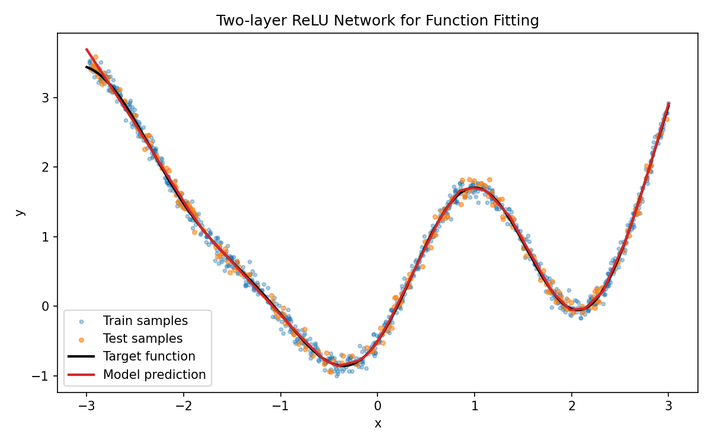

# 函数拟合实验报告（两层 ReLU 网络）

## 1. 实验目标
使用一个两层 ReLU 神经网络拟合自定义一元函数，并在测试集上验证拟合效果。

## 2. 函数定义
本实验定义目标函数为：

$$
f(x)=\sin(2x)+0.3x^2-0.5\cos(3x)
$$

说明：
- 该函数同时包含周期项和多项式项，具有一定非线性复杂度。
- 为更贴近实际观测数据，在采样标签中加入了小幅高斯噪声。

## 3. 数据采集与划分
数据由程序自行采样生成，设置如下：

- 采样区间：$x\in[-3,3]$
- 总样本数：1200
- 标签构造：$y=f(x)+\epsilon$，其中 $\epsilon\sim\mathcal{N}(0,0.08^2)$
- 训练/测试划分：80% / 20%

实现文件：
- [function_fitting_relu_pytorch.py](function_fitting_relu_pytorch.py)

## 4. 模型描述
采用两层 ReLU 网络（1 个隐藏层）：

- 输入层：1 维（$x$）
- 隐藏层：64 个神经元，激活函数 ReLU
- 输出层：1 维（回归输出）

网络结构：

$$
\hat{y}=W_2\,\mathrm{ReLU}(W_1x+b_1)+b_2
$$

训练配置：
- 优化器：Adam
- 学习率：$1\times10^{-2}$
- 损失函数：MSE（均方误差）
- 训练轮数：2500

## 5. 拟合效果
在 `deeplearning` conda 环境中实际运行得到：

- `train_mse = 0.006567`
- `test_mse = 0.006990`
- `test_r2 = 0.994418`

训练过程中测试误差稳定下降，最终测试集 $R^2$ 接近 1，说明模型对目标函数拟合效果较好，泛化性能正常。

## 6. 可视化结果
脚本输出了拟合图：

图中包含训练样本、测试样本、目标函数曲线和模型预测曲线，预测曲线与目标函数基本重合。

## 7. 结论
两层 ReLU 网络可以有效拟合该非线性函数，满足题目要求：

- 已自行定义函数
- 已自行采样并划分训练/测试集
- 已完成训练与测试验证
- 已给出代码与实验报告
